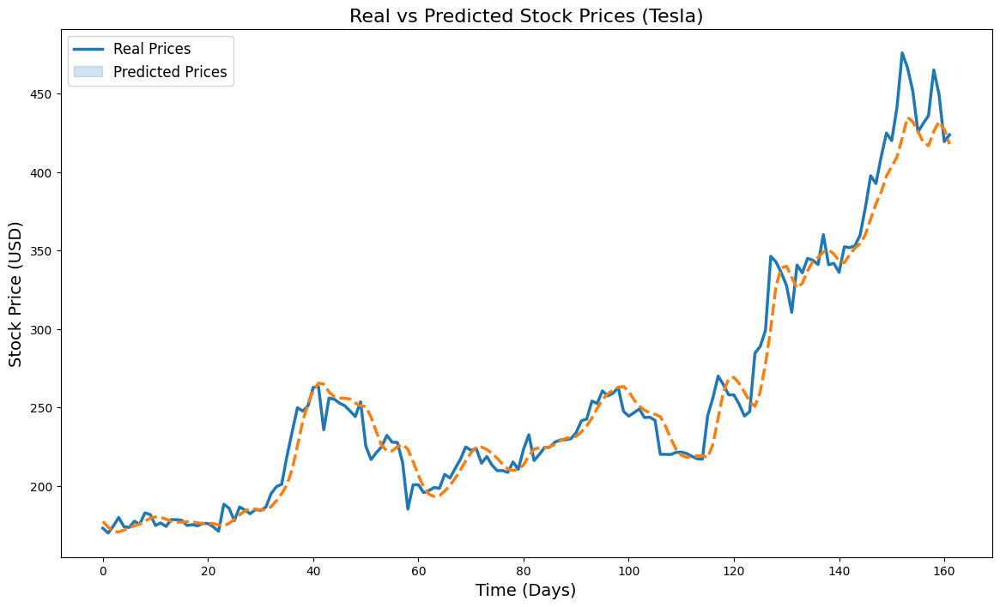

# Tesla Stock Price Prediction

This project demonstrates the use of machine learning techniques to predict Tesla's stock prices based on historical data. The model is built using LSTM (Long Short-Term Memory) neural networks to analyze the sequential nature of stock prices.

## Features

- **Data Visualization:** A heatmap to display correlations between stock price features.
- **Data Preprocessing:** Scaling and reshaping stock price data for machine learning.
- **LSTM Model:** A multi-layered LSTM network to predict the opening price.
- **Prediction and Comparison:** Visualization of real vs. predicted stock prices.

## Tools and Libraries

- **Python:** Core programming language.
- **Libraries:**
  - `pandas` and `numpy`: Data manipulation and analysis.
  - `matplotlib` and `seaborn`: Data visualization.
  - `scikit-learn`: Preprocessing and scaling.
  - `tensorflow.keras`: LSTM model.
  - `yfinance`: Fetching historical stock data.

## Prerequisites

Ensure the following Python libraries are installed:

```bash
pip install numpy pandas matplotlib seaborn scikit-learn tensorflow yfinance
```

## File Structure

- `TESLA.csv`: Historical Tesla stock price data.
- `predicted_real_comparison.png`: Visualization comparing predicted and real prices.
- `README.md`: Documentation for the project.
- Script file containing the project code.

## Model Overview

The LSTM model is configured as follows:

- **Layers:** 4 LSTM layers with 50 units each, followed by a dense output layer.
- **Dropout:** 20% to prevent overfitting.
- **Optimizer:** Adam.
- **Loss Function:** Mean Squared Error.

### Training Parameters

- **Epochs:** 30
- **Batch Size:** 32

## Visualization

The following image compares real and predicted stock prices:



## Future Work

- Enhance the model by tuning hyperparameters.
- Incorporate additional features such as market sentiment data.
- Extend predictions for multiple stock price attributes.

## Acknowledgments

Special thanks to:
- **Yahoo Finance API** for providing historical stock data.
- **The open-source community** for libraries used in this project.

